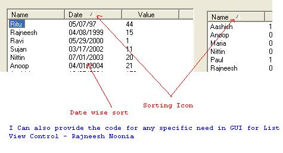



## Extended List View COM Component

### Description

There are lot of codes around the world to extended the features of standard List View Control. But there are lot of codings or extra effors to implement the extended behiviour of list view control in your project.This component (ListViewEx) can extendend the features of your existing List View control with only one line of Code. For the time being this support Sorting list view and adding the sort icon in the header. This component provides standard sorting as date/string and numeric.This also provides simple way to implement custom shorting method on any column.
 
### More Info
 
Standard List View control with data

Generaly string based sorting is provided with standard listview control. But what happens when you want to add the date or numeric or custom sorting algorithm to your list view control ? This COM Component add all these funcility to your listview control with one line of code. If you want to add the custom sorting algorithm on one of column then you need to implement interface ICompare. The code is self explanaratory and expose the power of interface programing and Win 32 API. Please don't forget to vote for this because i may upload the further enhancement in this component with you motivations.

Thanks

Sorting of Columns without any coding.

             |
---                |---
**Submitted On**   |2005-09-19 16:54:38
**By**             |[Rajneesh Noonia](https://github.com/Planet-Source-Code/PSCIndex/blob/master/ByAuthor/rajneesh-noonia.md)
**Level**          |Advanced
**User Rating**    |5.0 (10 globes from 2 users)
**Compatibility**  |VB 5\.0, VB 6\.0
**Category**       |[Custom Controls/ Forms/  Menus](https://github.com/Planet-Source-Code/PSCIndex/blob/master/ByCategory/custom-controls-forms-menus__1-4.md)
**World**          |[Visual Basic](https://github.com/Planet-Source-Code/PSCIndex/blob/master/ByWorld/visual-basic.md)
**Archive File**   |[Extended\_L1933779192005\.zip](https://github.com/Planet-Source-Code/rajneesh-noonia-extended-list-view-com-component__1-62560/archive/master.zip)

